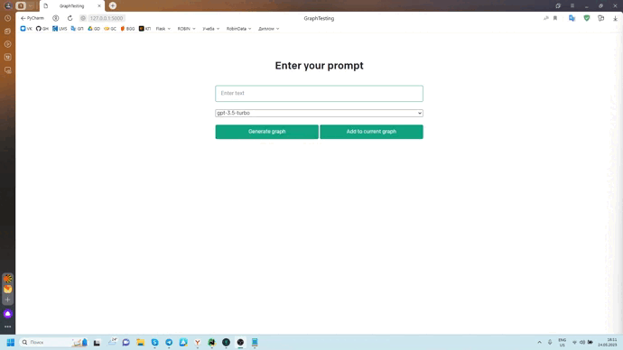

# GraphGPT
### Natural Language → Knowledge Graph

This product converts unstructured textual medical data into such a knowledge representation model as a knowledge graph. This algorithm supports any text, but is especially specialized in medical data based on the input message. If necessary, you can change the input examples `/prompts/statefull.prompt` and get better processing for other topics.

The algorithm supports both the creation of a graph from scratch and the addition of an existing one, which is especially useful for large input messages.

## Setup
1. Create virtual environments `python -m venv venv`
2. Activate virtual environments `venv/Scripts/activate`
3. Install requirements `pip install -r requirements.txt`
4. Run application `flask run`
5. Go to `http://127.0.0.1:5000` and try
